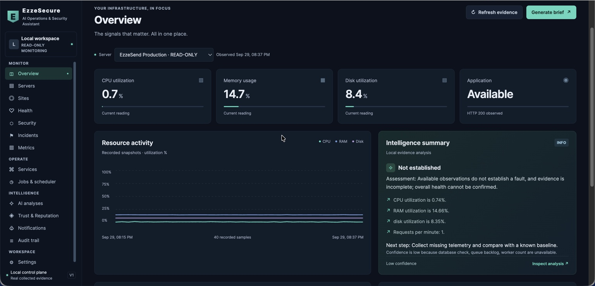
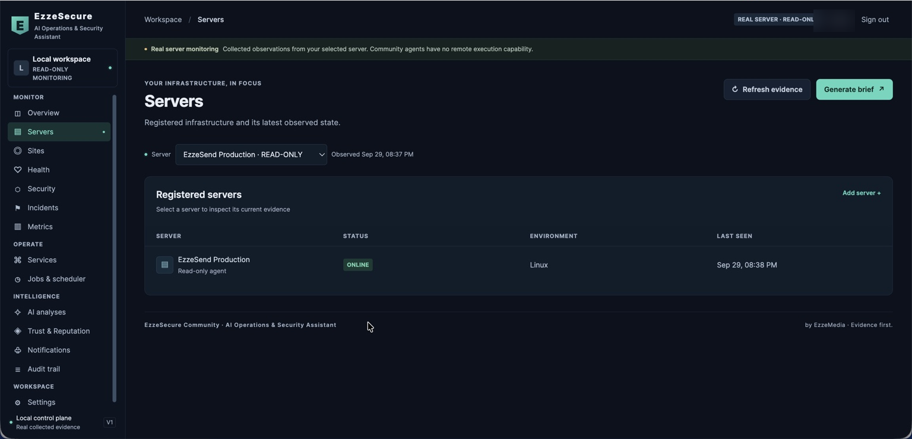
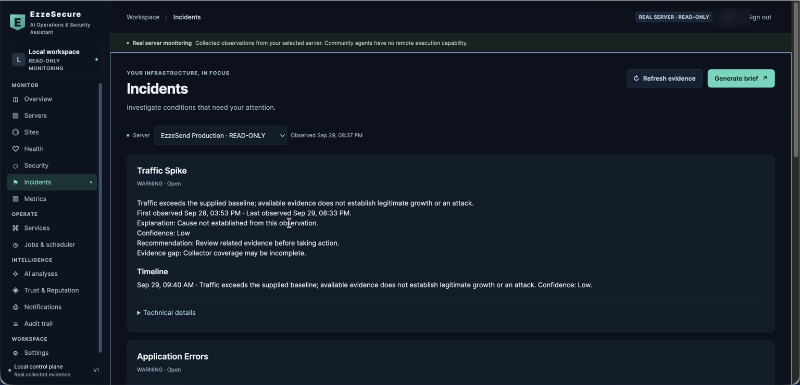
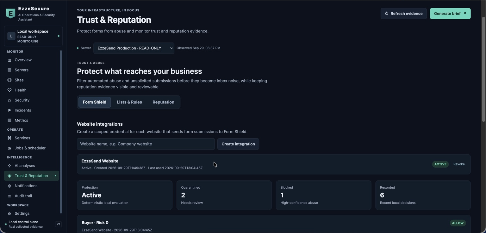

# EzzeSecure

**AI Operations & Security Assistant for Linux Servers**

**EzzeSecure Community v0.1.0 — Community Preview · by EzzeMedia**

     

EzzeSecure is a self-hosted Linux operations and security investigation platform. A read-only agent sends bounded evidence to a local control plane, where operators inspect server health, incidents, forensic events, and domain or form abuse signals. The Community Preview supports investigation of real servers without remote shell or production actions.

## From alert to investigation

Traditional monitoring tells you **what** crossed a threshold. EzzeSecure is designed to help ask when a condition started, what changed, which observations support it, and what to investigate next.

**Observe → Understand → Investigate → Explain → Alert → Recommend**

Explanations are evidence-based assessments. They do not prove a root cause when telemetry is incomplete.

## Screenshots

<table>
  <tr>
    <td width="50%" valign="top">
      <br>
      <strong>Overview</strong> — server health, resources, and operational status
    </td>
    <td width="50%" valign="top">
      <br>
      <strong>Server Detail</strong> — metrics, services, capacity, and collected evidence
    </td>
  </tr>
  <tr>
    <td width="50%" valign="top">
      <br>
      <strong>Incident Investigation</strong> — incident timeline and investigation context
    </td>
    <td width="50%" valign="top">
      <br>
      <strong>Trust &amp; Reputation</strong> — domain reputation and Form Shield controls
    </td>
  </tr>
</table>

## What you can do today

| Outcome | Implemented capability |
| --- | --- |
| Observe Linux hosts | CPU, memory, disk, load, network and disk counters, sampled processes, and listening ports. Configured adapters can add systemd services, Laravel health evidence, web access and auth log summaries, and discovered sites. Missing evidence is marked unavailable. |
| Investigate conditions | Deterministic analysis, resource policies, correlated incidents, incident timeline, audit trail, and local notifications. Optional SMTP email and EzzeSend delivery require configuration. |
| Preserve selected evidence | Optional Black Box sampling of auth activity, file changes, processes, and connections; sequence and hash-chain checks detect gaps or later local alteration. |
| Check domain trust | On-demand DNS, TLS, MX, SPF, and DMARC checks with explicit mail applicability. Findings are individual observations, not a universal reputation score. |
| Protect website forms | Form Shield returns `allow`, `quarantine`, or `block`; owner-managed Allowlist, Watchlist, and Blocklist rules; scoped integration credentials and reviewable abuse events. |
| Review evidence with AI | Optional BYOK provider selects and orders bounded deterministic evidence and recommendations. Core monitoring works without it. |

## Architecture

```text
Browser / Operator
        |
        v
EzzeSecure Control Plane (127.0.0.1)
        ^
        | outbound, authenticated telemetry
        |
EzzeSecure Linux Agent
        |
        v
Monitored Linux Server
```

**The Agent observes. The Control Plane investigates.** The Linux Agent collects bounded operational and security evidence. The Control Plane stores observations, correlates signals into incident context, and presents findings and recommendations for operator review. The real agent does not fetch or execute control-plane actions.

## Five-minute local quick start

This starts the control plane with its built-in **simulated** server. Python 3.11+ is required; Linux is required for real host collection. Core monitoring uses the Python standard library. Run from the checkout; no package installation is needed.

```bash
git clone https://github.com/asom007/EzzeSecure.git
cd EzzeSecure
python3 -m venv .venv
source .venv/bin/activate
python -m heimdall serve --port 8787 --state-dir ./.local
```

Open **http://127.0.0.1:8787**. On first startup the terminal prints a generated username and one-time initial password; sign in with them and store the password safely. The default username is `operator`. The initial password is not printed again. In another terminal, check health:

```bash
curl --fail http://127.0.0.1:8787/api/health
```

Expected response: `{"status":"ok"}`. The service binds to loopback. `config/local.example.json` is read automatically on first initialization; **do not copy it to `config/local.json`**. Set supported `EZZESECURE_*` environment values before first startup if you need a different organization or username. A separate state directory is needed when switching from demo to production mode. See [installation and secure exposure](docs/INSTALL.md).

## Add your first real server

1. Sign in and choose **Servers → Add server**. Enter a name. This creates a local server record and a one-use enrollment token; it does not connect to or change the host.
2. Clone this same repository on the Linux host, create a venv, and run the module from its checkout as above. The agent needs network access to the control plane: use the local loopback URL when both run on one host, or an HTTPS reverse proxy or secure tunnel for a separate host.
3. On the Linux host, from the checkout with the venv active, enroll. This local example assumes both processes are on the same machine:

   ```bash
   python -m ezzesecure.agent --state-dir .local/agent enroll \
     --url http://127.0.0.1:8787 \
     --credentials .local/agent/credentials.json
   ```

   Paste the token at the protected prompt. The agent writes an owner-only credential file. For a separate host, substitute the configured HTTPS origin for the URL.
4. Send the first signed observation:

   ```bash
   python -m ezzesecure.agent --state-dir .local/agent poll \
     --url http://127.0.0.1:8787 \
     --credentials .local/agent/credentials.json --once
   ```

   The server moves from **Waiting for enrollment** to **Waiting for first heartbeat**, then **Online** after telemetry arrives. For ongoing collection, omit `--once`; the default poll interval is 30 seconds. Run it under a process supervisor of your choice if you need persistence. No service unit is supplied in this repository.

Enrollment tokens expire after **10 minutes** and are consumed once. Community v0.1.0 allows **one active monitored agent**; revoke or re-enroll the existing identity before replacing it. The UI also displays commands for a separately packaged `agent.pyz`; that artifact is not in this checkout, so use the module commands above. See [agent setup and evidence](docs/AGENT.md).

## Investigation and Black Box

The control plane stores snapshots and deterministic analyses, groups recurring signals into incidents, records first and last observation times, and builds an investigation timeline. Resource policies can mark sustained pressure or recovery. Operator review remains necessary: a threshold crossing, sampled process, or log tail alone does not establish cause.

Black Box is **opt-in** in the agent's trusted local JSON configuration. It samples selected auth log, file integrity, process, and network events and keeps a bounded private outbox. On receipt, the control plane checks event sequence and a local hash chain, and reports evidence gaps. This verifies continuity of stored receipts after collection; it cannot attest that a compromised source host reported truthful events or provide complete audit coverage. Details: [Agent](docs/AGENT.md) and [Security](docs/SECURITY.md).

## Trust & Reputation

An owner can scan a domain in **Trust & Reputation**. The scanner checks public DNS resolution and TLS certificate verification; when `dig` is installed, it also checks MX and TXT records for SPF and DMARC. Mail checks run when MX, SPF, or DMARC evidence indicates mail use. The scan does not test DKIM or external blocklists. Without working `dig` lookups, mail applicability can be marked `not_applicable` from missing evidence; do not treat that as proof the domain has no mail service.

| Finding | Example meaning |
| --- | --- |
| Healthy | A trusted TLS certificate verified, or an SPF record was found where mail is detected. |
| Attention | Mail is detected but SPF or DMARC is absent, or TLS verification failed. |
| Not Applicable | No MX, SPF, or DMARC evidence of mail service was detected; mail checks are skipped. Confirm DNS lookups worked before relying on this label. |

These are observable configuration findings, not a single domain reputation score.

## Form Shield

```text
Website form → Form Shield evaluation API → allow / quarantine / block
                                              ↓
                           Your application decides whether to create a record
```

Create a per-website credential in **Trust & Reputation → Form Shield Integrations**. The integration sends a server-side JSON `POST` to `/api/integrations/form-shield/evaluate` with `Authorization: Bearer <credential>`. It receives a decision, risk score, intent, evidence, matching rules, and event ID. Keep credentials off browser pages and out of public issues. The website decides how to handle unavailable evaluation, including whether to fail open or closed. [Integration fields and example](docs/FORM-SHIELD.md).

Allow rules cap ordinary content risk, but do not override an explicit block rule or populated honeypot. Watch rules add risk; block rules force a block. Quarantined events can be reviewed and released or marked blocked in EzzeSecure; that status change does not retroactively create a website business record.

## Optional AI and notifications

Deterministic monitoring and incident analysis run without AI. For BYOK evidence review and encrypted EzzeSend notification credentials, install the optional dependency:

```bash
python -m pip install -r requirements-ai.txt
```

The provider receives a bounded selection of deterministic facts and recommendations, then returns IDs selecting and ordering them. It cannot introduce new findings or execute server actions. Provider keys are sensitive and should be configured only through protected settings. Local alert history works without external delivery. Optional email uses SMTP settings and credentials supplied through the control-plane process environment; EzzeSend delivery requires separate configuration.

## Security and deployment

The HTTP service binds to `127.0.0.1`. For remote operators and agents, expose it through a correctly configured HTTPS reverse proxy or secure tunnel. Production mode requires an HTTPS control-plane origin and demo-free state. Agent enrollment uses expiring one-use tokens; telemetry is HMAC signed with timestamps and replay nonces. Browser sessions use an HTTP-only same-site cookie, CSRF token, and Host/Origin checks. Requests are bounded and audit records are redacted. [Security details](docs/SECURITY.md).

Use a VPS or dedicated Linux host when you need broad `/proc`, log, and service visibility. Restricted shared hosting may hide evidence or prevent an agent process from running. EzzeSecure reports unavailable observations rather than treating them as healthy.

## Who it is for

Linux administrators, DevOps and SRE teams, MSPs, hosting providers, SaaS operators, security teams, agencies managing infrastructure, and self-hosted application operators evaluating Linux server monitoring, VPS health, incident investigation, and website form abuse protection.

## Community Preview limits

- Preview software; validate it before relying on it operationally.
- Community Preview currently runs directly from the source checkout.
- One active real Linux agent per Community control plane.
- Real-server monitoring is read-only. Remote execution and production actions are unavailable; action demonstrations are confined to the local simulator.
- Evidence quality depends on host permissions, configured adapters, polling cadence, and available logs. Black Box is sampled evidence, not complete endpoint protection.
- EzzeSecure is not a backup system or a universal SIEM replacement.
- This repository currently has no explicit open-source license. See [licensing status](docs/LICENSING.md).

## Roadmap

**v0.2.0 — Intelligent Watchdog (planned):** Read-only WhatsApp server visibility and evidence-supported infrastructure questions.

**v0.3.0 — Secure Remote Operations (planned):** Controlled, allowlisted server actions with explicit approval and post-action verification.

These capabilities are not currently available. The roadmap is directional and may change based on Community feedback, technical validation, and security review. See the [full roadmap](ROADMAP.md).

## Project guides

[Install](docs/INSTALL.md) · [Agent](docs/AGENT.md) · [Form Shield](docs/FORM-SHIELD.md) · [Security](docs/SECURITY.md) · [Contributing](CONTRIBUTING.md) · [Licensing](docs/LICENSING.md)
